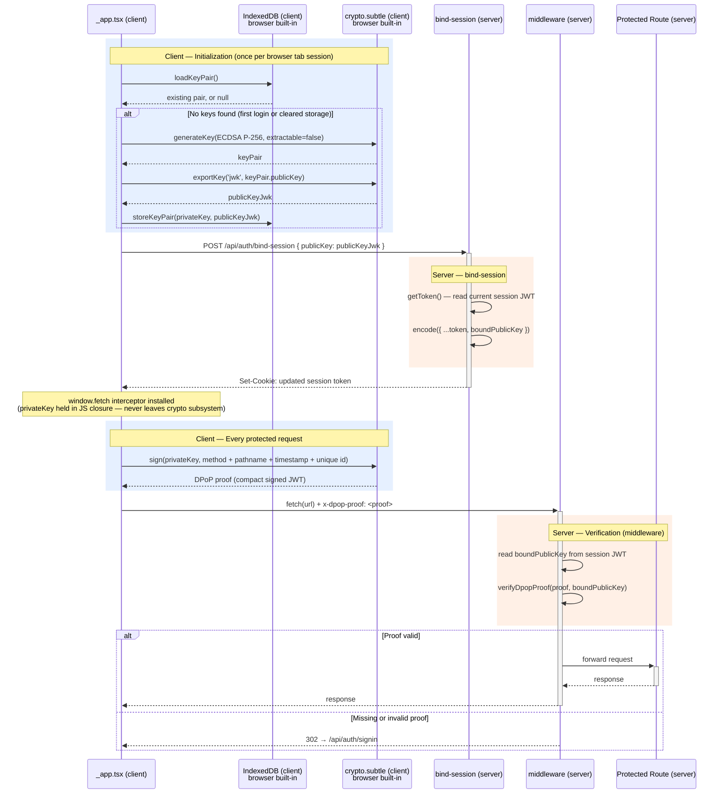

# Design: IZG-SEC-2026-001 — Session Replay Remediation (Code Mitigations)

## Overview

This CR implements the two code-level mitigations for the Playwright session replay
vulnerability. Operational mitigations (WAF IP allowlist, Elasticsearch Watcher) are
outside this CR and have been applied separately.

**Severity:** HIGH CVE — IZG-SEC-2026-001
**CVSS v3.1:** 7.1 High unmitigated

| # | Mitigation | Effort |
|---|---|---|
| 3 | CC token store fix | One-line deletion |
| 4 | WebCrypto DPoP session binding | ~2 days with AI assistance |

---

## Mitigation 3 — CC Token Store Fix

### Problem

`src/pages/api/auth/[...nextauth].ts` stores the Okta access token in the NextAuth
JWT cookie:

```ts
token.accessToken = account.access_token   // line 42 — deleted
```

NextAuth encrypts this into the session cookie. A session replay attacker who
captures the cookie receives the access token inside it, extending the effective
damage window from 30 minutes (NextAuth session lifetime) to 60 minutes (Okta
access token lifetime).

### Key finding

A full codebase grep confirms `token.accessToken` is **set but never read** anywhere
in CC. The only use of the raw access token is the userinfo fetch at line 49, which
reads `account.access_token` directly (only available at login time).

### Fix

Delete line 42 of `src/pages/api/auth/[...nextauth].ts`. No tokenStore or consumer
updates required.

### Verification

After removing the line:

1. Log in — confirm session works and `session.user` fields populate correctly.
2. Navigate admin-only pages — confirm `isAdmin` and `jurisdictions` resolve.
3. Log out — confirm session clears normally.
4. Inspect the NextAuth cookie in DevTools — confirm `accessToken` field is absent
   from the decoded JWT payload.

---

## Mitigation 4 — WebCrypto DPoP Session Binding

### Overview

Bind every authenticated session to a non-exportable ECDSA P-256 private key
generated in the originating browser. A stolen session cookie is useless without
the private key, which cannot be extracted by any software path including CDP.

No external library (e.g. `jose`) is required. All operations use native
`crypto.subtle`, which is available in the browser, Next.js Edge Runtime, and
Node.js 24.

### Data flow

The diagram below shows the two phases: initialization and the per-request proof
cycle.

Initialization runs **once per browser tab session**, not once per page navigation.
`Auth` lives in `_app.tsx`, which is the single app-wide wrapper in Next.js Pages
Router. Client-side navigation between pages only swaps the inner `<Component>`
while `Auth` stays mounted. The `window.fetch` interceptor installed during
initialization therefore covers all requests made anywhere in the app for the
lifetime of the tab.



### Key generation and storage (`src/lib/sessionKeys.ts`)

The private key is generated by the browser's built-in `crypto.subtle` API with
`extractable: false`. This flag is enforced by the browser's cryptographic
subsystem — it means the raw key bytes can never be read out by JavaScript, no
matter what. CDP's `storageState()` can only capture what JavaScript can reach;
a non-extractable key is invisible to it.

The key is generated as an ECDSA P-256 key pair. The **private key** stays inside
the browser's crypto subsystem. The **public key** can be freely shared — it is
exported in JWK format (JSON Web Key, a standard JSON representation of a
cryptographic key) so it can be sent to the server and stored in the session.

Both keys are persisted in **IndexedDB** — the browser's built-in structured
storage database. Unlike `localStorage` or cookies, IndexedDB can store live
`CryptoKey` objects directly. The private key object is stored by reference; the
key material itself remains inside the crypto subsystem. The public key JWK is
stored alongside it so that on a page reload the same key pair can be reused
without needing to generate a new one and re-bind to the session.

`sessionKeys.ts` exports three functions used by `_app.tsx`:

```ts
// Store both keys after generation (two writes to the 'keys' object store)
export async function storeKeyPair(
  privateKey: CryptoKey,
  publicKeyJwk: JsonWebKey
): Promise<void>

// Load an existing key pair, or return null if none exists
// (triggers fresh generation in _app.tsx)
export async function loadKeyPair(): Promise<{
  privateKey: CryptoKey
  publicKeyJwk: JsonWebKey
} | null>

// Delete both keys in a single atomic transaction (called on session cleanup)
export async function clearSessionKeys(): Promise<void>
```

### Session binding endpoint (`src/pages/api/auth/bind-session.ts`)

After generating or loading the key pair, `_app.tsx` POSTs the public key JWK to
`/api/auth/bind-session`. The endpoint reads the current NextAuth JWT, adds
`boundPublicKey`, re-encodes it, and re-issues the session cookie.

The endpoint derives the cookie security attributes from the incoming request's
`x-forwarded-proto` header and the `NEXTAUTH_URL` env var, matching the logic
next-auth@4 uses when issuing its own cookies.

### DPoP proof builder and verifier (`src/lib/dpop.ts`)

All JWT encoding uses native `crypto.subtle` and `btoa`/`atob`. No `jose` or other
library is introduced.

**Client-side (`buildDpopProof`):**

```ts
const header = { alg: 'ES256', typ: 'dpop+jwt' }
const payload = {
  htm: method.toUpperCase(),
  htu: pathname,          // URL path only, no query string
  iat: Math.floor(Date.now() / 1000),
  jti: crypto.randomUUID()
}
// header.payload signed with ECDSA P-256, returned as base64url JWT string
```

**Server-side (`verifyDpopProof`):**

Validates: JWT structure, `iat` within ±30 seconds, `htm`/`htu` match the request,
`jti` not previously seen, cryptographic signature against `boundPublicKey` from
the session token.

### Fetch interceptor (`src/pages/_app.tsx`)

After binding, `_app.tsx` installs a `window.fetch` interceptor in the `Auth`
component. Every outgoing request has a `x-dpop-proof` header attached, signed with
the session's private key and scoped to the request's URL path and method.

When the component is torn down, the interceptor is removed and the initialization
flag is reset so that DPoP re-initializes correctly if the component is recreated.
This matters in two situations: React's development mode deliberately destroys and
recreates every component once at startup to surface cleanup bugs (if the flag were
not reset, the second creation would skip DPoP setup entirely); and any genuine
recreation at runtime — for example after an error recovery — goes through the same
path and needs a clean slate.

### Middleware verification (`src/middleware.ts`)

`withAuth` wraps the middleware, ensuring authentication is confirmed before the
DPoP check runs. `boundPublicKey` is read from `req.nextauth.token` (populated by
`withAuth` — no second token decode required).

If `boundPublicKey` is present and the request lacks a valid `x-dpop-proof`, the
middleware redirects to `/api/auth/signin`.

Excluded from DPoP enforcement: `/api/auth/**`, `/_next/**`, `/api/healthcheck`,
`/api/deephealthcheck`.

### jti replay protection

A module-level `Map<string, number>` tracks seen jti values with a 60-second TTL.
This provides effective replay protection within a single ECS Fargate process.

> **Limitation:** The store is process-local. In a multi-isolate deployment (Vercel
> Edge, Cloudflare Workers), each isolate starts with an empty Map and replay
> protection becomes best-effort. An external shared store (Redis, KV) would be
> required for guaranteed deduplication in such an environment. This is not a
> concern for the current ECS Fargate deployment.

### Browser compatibility

| Browser | `crypto.subtle` | ECDSA P-256 | IndexedDB | Status |
|---|---|---|---|---|
| Chrome (latest) | ✅ v37+ | ✅ | ✅ | No issues |
| Edge (latest) | ✅ v79+ | ✅ | ✅ | No issues |
| Firefox (latest) | ✅ v34+ | ✅ | ✅ | No issues |
| Safari 17/18 | ✅ v11+ | ✅ | ✅ | No issues |

Prerequisite: secure context (HTTPS) — already satisfied by all CC deployments.

### Implementation order

1. `izg-configuration-console` — this CR
2. `izg-transformation-ui` — follow-on CR, same pattern

---

## Security Review

- 2026-05-15: Security Lead / Consultant — initial review
- 2026-05-19: Security Team — Phase 4 approach confirmed; Phases 1–2 accepted as
  sufficient interim controls while this CR is implemented
