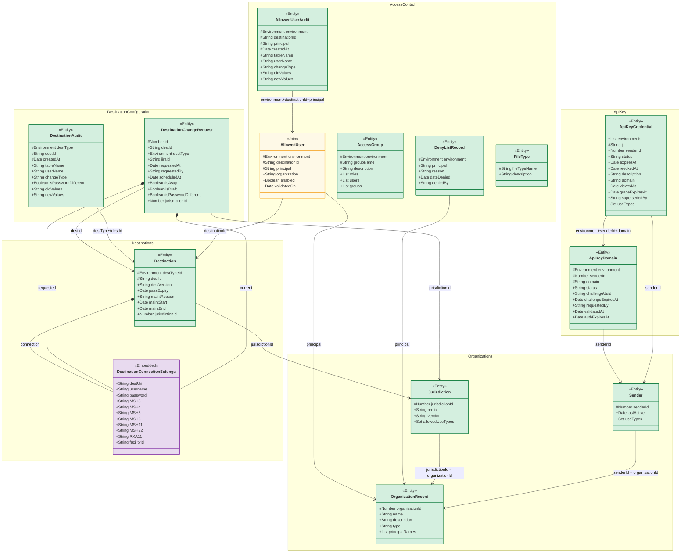
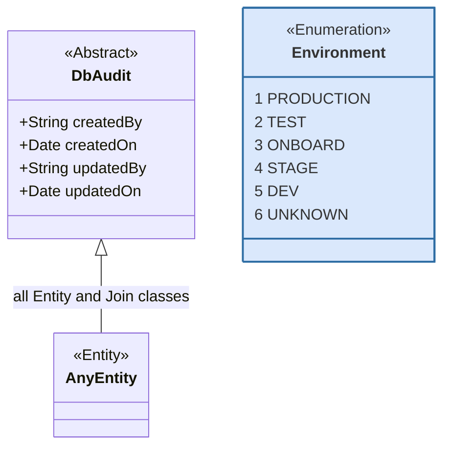
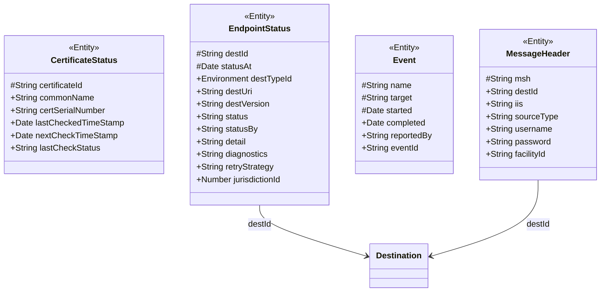

# API Key Management — Design

See [proposal.md](proposal.md) for motivation and capability definitions.

## Context

IZ Gateway uses a single DynamoDB table (`izgw-hub`) with a composite key:

- **Partition key:** `entityType` (String) — the entity class name
- **Sort key:** `sortKey` (String) — assembled from the `#`-marked key fields of each entity, in listed order

All entities the Configuration Console manages live in this table. A set of additional entities in the same table are written exclusively by `izgw-hub` (see [Hub-Managed Entities](#hub-managed-entities)).

Senders currently authenticate to IZ Gateway using mutual TLS certificates. There is no self-service mechanism for senders to obtain, renew, or revoke API credentials. This design introduces two new entity types (`ApiKeyDomain`, `ApiKeyCredential`) to support the full credential lifecycle, and extends three existing entities (`Jurisdiction`, `Sender`, `ApiKeyCredential`) with use-type fields that enforce a jurisdiction-level opt-in access policy.

## Goals / Non-Goals

**Goals:**
- Model the full API key credential lifecycle: domain authorization, credential issuance, grace-period renewal, and immediate revocation.
- Allow jurisdictions to declare which credential use-types they accept (`allowedUseTypes`), giving each jurisdiction opt-in control over who may access their IIS data via API key.
- Allow senders to declare what submitter categories they act on behalf of (`useTypes`), and scope individual credentials to a subset of those categories.
- Make no breaking changes to existing DynamoDB content. No data migration is required.

**Non-Goals:**
- Changes to the existing mTLS authentication path.
- Hub-side JWT validation logic (separate deliverable; listed as an impact dependency in the proposal).
- Modifications to existing `Jurisdiction`, `OrganizationRecord`, `Sender`, or `AllowedUser` data.

## Decisions

### Conceptual Data Model

The diagram below is the **conceptual schema** — it reflects the domain model as understood for design purposes, so that we can reason about entities in terms that make sense to users. It is explicitly **not** the physical DynamoDB layout.

Physically, `Organization`, `Jurisdiction`, and `Sender` are **not** separate tables. A single DynamoDB table (still named `Jurisdiction`) backs an `Organization` base class together with a `Jurisdiction` interface and a `Sender` interface. A single organization record MAY implement the `Jurisdiction` interface, the `Sender` interface, or both. This denormalized representation is chosen for efficiency and to avoid a DynamoDB schema migration (see [Sender Identity in the Physical Schema](#sender-identity-in-the-physical-schema) and [Migration & Seeding](#migration--seeding-ops-run)). The physical implementation may consolidate or alias entities this way, but must faithfully represent all relationships shown here.

**Field markers:** `#` (protected) = sort key component, listed in sort order. `+` (public) = non-key attribute. `entityType` and `sortKey` are DynamoDB infrastructure fields omitted from the diagram — the class name is the `entityType` and `sortKey` is assembled from the `#` fields.

The `Environment` type is a fixed in-memory enumeration — see [DbAudit Base Class](#dbaudit-base-class). All `environment`/`destType`/`destTypeId` fields hold the numeric environment ID (1–6).

### DbAudit Base Class

All `<<Entity>>` and `<<Join>>` classes in the above diagram derive from `DbAudit`, which provides fields used to track changes in the database. `Environment` is a fixed in-memory enumeration defined in `src/lib/desttypehelper.ts` (CC) and the equivalent in `izgw-hub`; it is **not** stored in DynamoDB. Fields typed `Environment` in the main diagram hold the numeric ID (1–6).

### Use-Type Policy Enforcement

`Jurisdiction.allowedUseTypes` declares which credential purposes a jurisdiction permits access to its IIS data — the jurisdiction's opt-in policy. `Sender.useTypes` declares what submitter categories a sender acts on behalf of (patients, providers, public health agencies). `ApiKeyCredential.useTypes` scopes a specific credential to one or more of those categories.

A credential is valid for a given destination only when `credential.useTypes ∩ destination.jurisdiction.allowedUseTypes` is non-empty. Policy evolves by updating `allowedUseTypes` on the jurisdiction alone — no credential or sender records need to change.

**Examples:**
- Texas: `allowedUseTypes = [PROVIDER]` — accepts provider credentials only (current state law restricts patient and public health access)
- New Jersey / Utah: `allowedUseTypes = [PATIENT, PROVIDER, PUBLIC_HEALTH]` — fully open
- Massachusetts: `allowedUseTypes = [PROVIDER, PUBLIC_HEALTH]`

### AllowedUser as Relationship Class

`AllowedUser` is the authorization join between a sender principal and a `Destination`, scoped by environment. It is effectively `OrganizationRecord ↔ Destination` with env scope.

### Migration & Seeding (ops-run)

`ApiKeyDomain` and `ApiKeyCredential` are new entities with no existing production data, and the new fields on `Jurisdiction`/`Sender` are optional at the schema level, so no schema migration is needed to keep existing records readable. However, a one-time **data** migration IS required, and it will be run by operations — **not** by console startup code:

- **Seed sender organizations.** Non-jurisdiction senders (e.g., Docket, Mayo, VHA, DOW) are added to the `Jurisdiction` table as records that implement the `Sender` interface, each with `useTypes` set. See [Sender Identity in the Physical Schema](#sender-identity-in-the-physical-schema) for how IDs are allocated.
- **Backfill jurisdiction policy.** Existing `Jurisdiction` records are updated with correct `allowedUseTypes`. Until this runs, the Hub use-type intersection would deny all API-key traffic to those jurisdictions (empty `allowedUseTypes` denies everything), so the backfill is a prerequisite for enabling Hub enforcement.

**Why ops-run, not auto-startup:** a startup migration would need a cross-instance lock (two console instances start concurrently), which DynamoDB does not natively provide; a faulty auto-migration could take the whole system down; and it is hard to test safely. The one-time nature does not justify introducing a migration framework. Instead the change ships as a scripted set of AWS CLI commands executed with operations (the "seeding task" run with Emiline).

**Seeding is not authorization.** Adding a sender/jurisdiction row grants no access by itself. Jurisdiction-scoped RBAC is driven by Okta group membership (`session.user.jurisdictions`), provisioned out-of-band. Seed rows and Okta groups must be kept in sync.

### Sender Identity in the Physical Schema

`senderId` is a foreign key to the physical `Jurisdiction` entity. Conceptually, a `Sender` is distinct from a `Jurisdiction` (a sender may not be a public health agency), but in the physical implementation there is one `Jurisdiction` record per sending organization. Non-jurisdiction senders (Docket, Mayo, VHA, DOW) are represented as `Jurisdiction` entries with appropriate `useTypes`. The conceptual `Sender` entity is a logical view over the physical `Jurisdiction` table.

**ID allocation.** `senderId`, `organizationId`, and `jurisdictionId` are the same value drawn from a single namespace with a single uniqueness rule: every record in the table has a distinct ID, and a newly seeded sender is issued a new unique ID that does not already exist in the table (IDs are never reused). Because IDs are never reused, the shared `id → name` label-enrichment lookup used across the console (Destinations, the Connections "Organization" column, the API-key list) cannot resolve one entity's ID to another entity's name. `Jurisdiction` and `OrganizationRecord` are **one-to-one** in both the conceptual and physical models (an ERD would show this directly; a class diagram is used here only because the relationship did not render cleanly as an ERD).

**Distinguishing senders from jurisdictions.** No separate type-discriminator flag is stored. The distinction is implied by field presence: a record with `allowedUseTypes` acts as a **jurisdiction**; a record with `useTypes` acts as a **sender**; a single record MAY have both and thus act as both. Non-persisted transient helper methods `isSender()` / `isJurisdiction()` on the entity class (annotated so they are not serialized to DynamoDB) expose this test to callers and to the UI — e.g., labeling entries in the Organization dropdown, which is populated from the full `Jurisdiction` table and therefore intermixes states with commercial/federal senders.

### useTypes Enumeration

Three canonical values: `PATIENT`, `PROVIDER`, `PUBLIC_HEALTH`. These are sufficient for the initial implementation. The set may be extended in future iterations.

### Grace Period Computation

The grace period is **10 business days**, computed from the renewal date. Business days exclude weekends and federal holidays (and potentially other recognized holidays). The computation logic is simple now and expected to become more refined over time — it should be isolated in a single utility function to support future refinement without touching credential lifecycle code.

### Multi-Environment Credentials for Admin and Operational Staff

`ApiKeyCredential.env` (as-built: a single string) is replaced by `environments`, a
list of numeric environment IDs (`number[]`, values 1–6 per the `Environment`
enumeration). Standard sender credentials contain exactly one environment ID.
Credentials issued to users with IZG Operations or Jurisdiction Operations roles MAY
contain multiple environment IDs, allowing a single credential to authenticate across
development, test, staging, onboarding, and production without maintaining a separate
credential per environment.

`environments` is a **server-side access control property**, not a JWT claim — it is
**not** carried in the token. At routing time the Hub looks the credential up by `jti`
and validates that the incoming request's environment is contained in the credential's
`environments` list. Keeping the list out of the token lets the permitted environment
set change (subject to access-control review) without reissuing a credential — the same
rationale that keeps `useTypes` server-side (see [Use-Type Policy Enforcement](#use-type-policy-enforcement)).

Because the permitted environments are an editable list rather than part of the
credential's identity, the `sortKey` is simply `{jti}` — there is no environment prefix
and no `primaryEnvId`. The Hub reads a credential directly by `jti`; no secondary index
on `jti` is required.

### Domain Verification Protocol

Domain ownership is verified via a **DNS TXT record** challenge. The challenge UUID is stored in `ApiKeyDomain.challengeUuid` with an expiry in `challengeExpiresAt`. The console polls or the sender triggers verification; on success `validatedAt` is set and the domain moves to `authorized` status.

The TXT record is placed at the **domain apex** — the exact name being validated — not under a `_izg-verify` (or similar) subdomain. This deliberately mirrors the DigiCert DNS-TXT validation procedure that jurisdiction IT teams already follow for certificate issuance, so no retraining of IIS IT staff is required. (Domain validation itself was a firm requirement from Dave Bike; matching the familiar procedure minimizes the multi-day ticket/turnaround cost each jurisdiction incurs to publish a DNS record.)

The signed JWT is **not** persisted. It is generated on demand by re-signing the credential's stored claims (see the credential-lifecycle spec, "JWT is deterministically re-signed"), returned to the sender once, and never retained by IZ Gateway — we keep no copy and cannot reproduce a sender's token. Its authenticity comes from the HMAC signature, not from storage. The token is signed with HS256 using the secret at `/izg/<env>/jwt/signing-secret` from AWS Secrets Manager; the JWT header carries a `kid` equal to the Secrets Manager version ID of the secret used to sign, and the payload includes an `iss` claim matching the Hub's configured `jwt.issuer`, so the Hub can select the correct secret version and validate the issuer before trusting the token. There is therefore **no** encrypted credential-value storage for `ApiKeyCredential` (in contrast to `Destination.password`, which must be retained and is stored via `EncryptedRepository`).

## Entity Quick Reference

| entityType | sortKey pattern | Purpose |
|---|---|---|
| `AccessGroup` | `{environment}#{groupName}` | RBAC groups with roles, users, and group members |
| `AllowedUser` | `{environment}#{destinationId}#{principal}` | Authorized sender certificates per destination |
| `AllowedUserAudit` | `{environment}#{destinationId}#{principal}#{timestamp}` | Change history for allowed users |
| `ApiKeyCredential` | `{jti}` | Issued API key credentials and their lifecycle status. The Hub reads directly by `jti`; there is no environment prefix on the key. `environments` is a `number[]` of env IDs stored as an attribute (single-entry for standard credentials; multi-entry for admin/ops credentials valid across environments) |
| `ApiKeyDomain` | `{envId}#{senderId}#{domain}` | DNS domains authorized for API key issuance |
| `DenyListRecord` | `{environment}#{principal}` | Certificates blocked from connecting |
| `Destination` | `{destTypeId}#{destId}` | IZ Gateway routing endpoints |
| `DestinationAudit` | `{destTypeId}#{destId}#{timestamp}` | Change history for destinations |
| `DestinationChangeRequest` | `hash(destType+destId)` | Pending change requests for destinations |
| `FileType` | `{fileTypeId}` | ADS file type definitions |
| `Jurisdiction` | `{jurisdictionId}` | Jurisdiction (state/territory) master data |
| `OrganizationRecord` | `{organizationName}` (physical, as-built) | Maps principal certificates to organizations. **Note:** the conceptual diagram keys this on `organizationId` (= `jurisdictionId`); the as-built physical `OrganizationRecord` is keyed by organization name. The two views reconcile 1:1 via the shared organization identity. |
| `Sender` | `{senderId}` | Sender identity, last-active timestamp, and use-type classifications |

## Hub-Managed Entities

The following entities exist in the same DynamoDB table (`izgw-hub`) but are **written and managed exclusively by `izgw-hub`**. The Configuration Console has no write path for these — they appear here for completeness and for operators who query the table directly.

| entityType | sortKey pattern | Purpose |
|---|---|---|
| `CertificateStatus` | `{certificateId}` | OCSP check cache: thumbprint → last/next check result |
| `EndpointStatus` | `{destId}#{statusAt}` | Point-in-time connection status snapshot per destination |
| `Event` | `{name}#{target}#{started}` | Hub lifecycle events (Migration, Startup, Shutdown, Created) |
| `MessageHeader` | `{msh}` | MSH-3/4 value → destination + jurisdiction routing |

## Risks / Trade-offs

- **Grace period enforcement** → Mitigation: `graceExpiresAt` is stored on the credential and checked server-side on every authentication; the hub must not rely on client-supplied expiry.
- **Revocation latency** → Mitigation: Revocation must be enforced at read time in `izgw-hub` against a live DynamoDB read (or short-TTL cache), not just at issuance time in the console. A compromised credential must be unusable within the cache TTL of revocation.
- **useTypes intersection enforcement** → Mitigation: The intersection check (`credential.useTypes ∩ jurisdiction.allowedUseTypes`) must be enforced in `izgw-hub` at authentication time, not at issuance time in the console. Issuing a credential for a use-type the destination jurisdiction does not permit must produce a clear error at authentication, not a silent failure.
- **Sender entity identity** → Resolved: `senderId` = `organizationId` = `jurisdictionId`, a single unique ID per record in the physical `Jurisdiction` table (see [Sender Identity in the Physical Schema](#sender-identity-in-the-physical-schema)).

## Open Questions

*(none — all questions resolved)*
